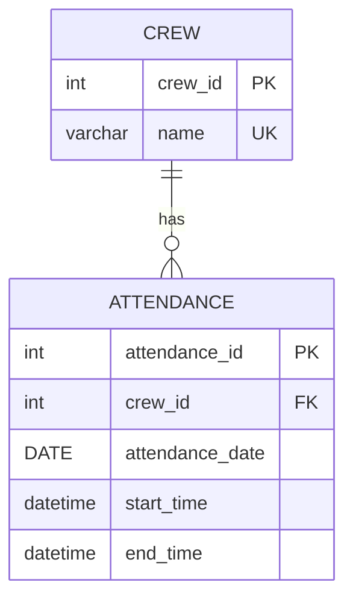

# DDL 실습
## 문제 1: 테이블 생성하기 (CREATE TABLE)

1. attendance 테이블은 중복된 데이터가 쌓이는 구조이다. 중복된 데이터는 어떤 컬럼인가?

    - crew_id를 통해 특정 크루를 식별할 수 있음에도 불구하고 매 출석마다 nickname이 반복 저장되고 있으므로 nickname이 중복 데이터입니다.

2. attendance 테이블에서 중복을 제거하기 위해 crew 테이블을 만들려고 한다. 어떻게 구성해 볼 수 있을까?

    ``` sql
    CREATE TABLE crew (
    crew_id INT NOT NULL,
    nickname VARCHAR(50) NOT NULL,
    PRIMARY KEY (crew_id)
    );
    ```

3. crew 테이블에 들어가야 할 크루들의 정보는 어떻게 추출할까? (hint: DISTINCT)

    - 크루의 고유 식별자인 crew_id를 기본키(Primary Key)로 설정하고, 크루의 이름인 nickname을 포함하도록 구성합니다.

4. 최종적으로 crew 테이블 생성:

    ``` sql
    CREATE TABLE crew (
    crew_id INT NOT NULL,
    nickname VARCHAR(50) NOT NULL,
    PRIMARY KEY (crew_id)
    );
    ```

5. attendance 테이블에서 크루 정보를 추출해서 crew 테이블에 삽입하기:

    ``` sql
    INSERT INTO crew (crew_id, nickname)
    SELECT DISTINCT crew_id, nickname 
    FROM attendance;
    ```

## 문제 2: 테이블 컬럼 삭제하기 (ALTER TABLE)

1. crew 테이블을 만들고 중복을 제거했다. attendance에서 불필요해지는 컬럼은?

    - nickname 칼럼이 불필요 해졌다고 생각합니다. crew_id를 외래키로 활용하여 crew 테이블과 조인하면 닉네임을 가져올 수 있기 때문입니다.

2. 컬럼을 삭제하려면 어떻게 해야 하는가?

    ``` sql
    ALTER TABLE attendance 
    DROP COLUMN nickname;
    ```

## 문제 3: 외래키 설정하기

    ``` sql
    ALTER TABLE attendance 
    ADD CONSTRAINT fk_attendance_crew 
    FOREIGN KEY (crew_id) REFERENCES crew(crew_id);
    ```

## 문제 4: 유니크 키 설정

``` sql 
ALTER TABLE crew 
ADD CONSTRAINT uk_crew_nickname 
UNIQUE (nickname);
```

---
# DML(CRUD) 실습

## 문제 5: 크루 닉네임 검색하기 (LIKE)

``` sql
SELECT nickname 
FROM crew 
WHERE nickname LIKE '디%';
```

## 문제 6: 출석 기록 확인하기 (SELECT + WHERE)

``` sql
SELECT a.*
FROM attendance a
JOIN crew c ON a.crew_id = c.crew_id
WHERE c.nickname = '어셔' 
  AND a.attendance_date = '2025-03-06';
```

## 문제 7: 누락된 출석 기록 추가 (INSERT)

``` sql
INSERT INTO attendance (crew_id, attendance_date, start_time, end_time) 
VALUES (
    (SELECT crew_id FROM crew WHERE nickname = '어셔'), 
    '2025-03-06', 
    '09:31:00', 
    '18:01:00'
);
```

## 문제 8: 잘못된 출석 기록 수정 (UPDATE)

``` sql
UPDATE attendance 
SET start_time = '10:00:00'
WHERE attendance_date = '2025-03-12' 
  AND crew_id = (SELECT crew_id FROM crew WHERE nickname = '주니');
```

## 문제 9: 허위 출석 기록 삭제 (DELETE)

``` sql
DELETE FROM attendance 
WHERE attendance_date = '2025-03-12' 
  AND crew_id = (SELECT crew_id FROM crew WHERE nickname = '아론');
```

## 문제 10: 출석 정보 조회하기 (JOIN)

``` sql
SELECT 
    c.nickname, 
    a.attendance_date, 
    a.start_time, 
    a.end_time
FROM attendance a
JOIN crew c ON a.crew_id = c.crew_id;
```

## 문제 11: nickname으로 쿼리 처리하기 (서브 쿼리)

``` sql
SELECT * FROM attendance 
WHERE crew_id = (
    SELECT crew_id 
    FROM crew 
    WHERE nickname = '검프'
);
```

## 문제 12: 가장 늦게 하교한 크루 찾기

``` sql
SELECT 
    c.nickname, 
    a.end_time
FROM attendance a
JOIN crew c ON a.crew_id = c.crew_id
WHERE a.attendance_date = '2025-03-05'
ORDER BY a.end_time DESC
LIMIT 1;
```

# 집계 함수 실습

## 문제 13: 크루별로 '기록된' 날짜 수 조회

``` sql
SELECT 
    c.nickname, 
    COUNT(a.attendance_date) AS recorded_days
FROM crew c
JOIN attendance a ON c.crew_id = a.crew_id
GROUP BY c.nickname;
```

## 문제 14: 크루별로 등교 기록이 있는(start_time IS NOT NULL) 날짜 수 조회

```sql
SELECT 
    c.nickname, 
    COUNT(a.start_time) AS attended_days
FROM crew c
JOIN attendance a ON c.crew_id = a.crew_id
GROUP BY c.nickname;
```

## 문제 15: 날짜별로 등교한 크루 수 조회

```sql
SELECT 
    attendance_date, 
    COUNT(crew_id) AS crew_count
FROM attendance
WHERE start_time IS NOT NULL
GROUP BY attendance_date
ORDER BY attendance_date;
```

## 문제 16: 크루별 가장 빠른 등교 시각(MIN)과 가장 늦은 등교 시각(MAX)

```sql
SELECT 
    c.nickname, 
    MIN(a.start_time) AS earliest_start, 
    MAX(a.start_time) AS latest_start
FROM crew c
JOIN attendance a ON c.crew_id = a.crew_id
GROUP BY c.nickname;
```

# 🤔 생각해 보기

## SQL 실습 관련

### 기본키란 무엇이고 왜 필요한가?

- 기본키란 테이블에서 각 행을 고유하게 식별하기 위해 지정된 칼럼으로, 중복과 null이 있어선 안됩니다. 기본키가 필요한 이유는 데이터 무결성 보장, 안전한 데이터 조작, 테이블 간 연결(외래키) 등을 위해 필요합니다.

### MySQL에서 사용되는 AUTO_INCREMENT는 왜 필요할까?

- 테이블에 새로운 데이터가 추가될 때 마다 지정된 칼럼의 값을 자동으로 1씩 증가시켜 주는 기능입니다. AUTO_INCREMENT를 통해 개발 편의성을 증가시키고, 개발자의 실수를 줄일 수 있습니다.

### 학생이 등교는 했지만 하교 버튼을 누르지 않았을 때, end_time에 NULL이 저장된다. NULL 값을 처리할 때 주의할 점은?

- null은 '0' 또는 '빈 공간'이 아닌, '아직 값을 알 수 없음' 또는 '값이 존재하지 않음'을 나타냅니다. null은 일반적인 비교 연산자(=, !=)로 검색할 수 없습니다. 검색하고자 하는 대상이 null인 경우 'IS NULL'또는 'IS NOT NULL'연산자를 사용해야 합니다. 또한 사칙연산에서 null이 포함될 경우 연산의 결과로 null이 반환되기 때문에 연산시 주의해야 합니다. 또한 집계함수는 null을 제외하고 카운팅합니다.
- 프론트엔드에선 null값에 대해 공백으로 표시할지, null에 의미를 부여하여 명시적으로 표시할 지 결정해야 합니다.

### crew와 attendance 테이블의 관계를 ER 다이어그램으로 시각화해보자. 이 관계를 일상 생활의 예시로 비유한다면 어떤 것이 있을까?

# crew와 attendance 테이블 ER 다이어그램



- 일상 생활의 예시: 도서관 회원과 대출 기록
    - 한 도서관 회원은 여러 권의 책을 빌릴 수 있지만, 각 책은 한 명의 회원에게 종속됩니다.

## 2026 공통강의 - DB 개념 연결

### 출석 시스템에서 동시에 100명이 등교 버튼을 누른다면 어떤 일이 일어날까? 이 문제를 2026 공통강의 - DB에서 배운 트랜잭션과 ACID 속성으로 설명해보자.

- 출석 시스템에서 100명이 등교 버튼을 동시에 누른다면 100개의 INSERT 및 UPDATE 요청이 동시에 발생하게 됩니다. 만약 동시성 제어가 제대로 처리되어 있지 않다면 데이터가 누락되거나 엉뚱한 데이터로 덮어씌워지는 동시성 문제가 발생할 수 있습니다. 이와 관련된 ACID 속성으로 '원자성 (atomicity)', '격리성(isolation)'이 있습니다.

- 원자성 (atomicity): "하나의 트랜젝션은 오나전히 성공하거나, 완전히 취소된다." 라는 의미로, 전체 작업 중 일부에서 실패가 발생한다면, 작업을 실행하기 전의 상태로 Rollback시킵니다.

- 격리성 (isolation): "각 트랜젝션의 서로에게 간섭할 수 없다"라는 의미로, 한 트랜젝션이 데이터를 처리중일 경우 해당 데이터에 대해 다른 트랜젝션은 끼어들지 못하도록 대기시킵니다. 이 상황에서 만약 서로 다른 트랜젝션이 서로가 점유중인 데이터를 요구하며 대기할 경우 교착상태 (DeadLock)가 발생할 수 있습니다.

### 출석 데이터가 파일(CSV)이 아닌 데이터베이스에 저장되는 이유는 무엇일까? 파일 시스템으로 출석을 관리했다면 어떤 문제가 생길까?

- 파일 시스템은 동시 접근, 데이터 일관성 유지, 검색 및 데이터 가공, 권한 관리 등에 약합니다. 여러 요청이 동시에 발생하면 데이터가 엉키거나 유실될 수 있고, '출석 시간'같은 데이터에서 누군가는 "09:00"의 형태로, 누군가는 "오전 9시"의 형태로 저장한다면 데이터 일관성이 깨질 수 있습니다.

### 출석 데이터를 관계형 DB가 아닌 NoSQL(예: MongoDB)로 저장한다면 테이블 구조가 어떻게 달라질까? 어떤 장단점이 있을까?

```json
{
  "crewid": "crew_101",
  "nickname": "김크루",
  
  "attendance_records": [
    { "date": "2026-04-06", "start_time": "08:50", "end_time": "18:10" },
    { "date": "2026-04-07", "start_time": "08:55", "end_time": null }
  ]
}
```

- 장점 : NoSQL은 각 문서마다 자유롭게 구조를 다르게 정의할 수 있어 스키마가 유연합니다. 또한 특정 크루의 전체 출석 기록을 보여줘야 할 경우 RDBMS에선 두 테이블을 join해야 하지만, NoSQL은 해당 크루의 문서만 읽어오면 됩니다.

- 단점 : 닉네임 중복 금지나 참조 무결성 같은 규칙을 RDBMS처럼 보장하기 어렵고, "오늘 지각한 학생 수", "월별 평균 출석 시간"같은 복잡한 통계 연산을 수행할 때 RDBMS보다 번거로울 수 있습니다.

# 🧐 더 생각해 보기 (심화)

### 왜 crew 테이블에서 nickname을 기본키로 하지 않은 걸까? attendance 테이블에 attendance_id가 존재하는 이유는 무엇일까?

- 현재 테이블에서 nickname은 UNIQUE 속성을 통해 중복을 허용하지 않습니다. 하지만 기본키는 "불변성"을 보장해야 합니다. nickname은 겹치면 안될 뿐이지 변경에 대한 제한은 따로 명시되어 있지 않습니다. 만약 처음 nickname을 지정한 후 여러 트랜잭션을 통해 데이터들이 추가되어 있는 상태로 크루의 nickname이 변경될 경우 nickname을 외래키로 참조하는 모든 테이블에도 수정이 발생하기 때문에 DB에 큰 부하가 발생합니다.

- attandance 테이블에 attandance_id가 존재하는 이유는 테이블 설계의 단순성과 확장성 때문입니다. 각 출석기록을 조회하는 상황에서 attandace_id가 없다면 테이블을 조회하기 위해 crew_id와 출석 일자를 동시에 사용한 복합키를 통해 조회를 하게 될 것입니다. 이 경우 쿼리문이 복잡해지며 인덱스의 키기가 커져 검색 성능이 저하될 수 있습니다.

### 데이터베이스 제약 조건 중 RESTRICT, CASCADE는 무엇인가?

- RESTRICT와 CASCADE는 외래키로 연결된 부모 테이블과 자식 테이블의 참조 무결성 유지 전략을 명시하는 방법입니다.

- RESTRICT: 자식 테이블이 참조하고 있는 부모 테이블의 데이터에 대한 삭제나 수정을 제한하는 옵션

- CASCADE: 부모 테이블의 데이터가 삭제될 때 이를 참조하고 있는 자식 테이블의 데이터도 함께 삭제되는 옵션

- 사용자 탈퇴시 게시글 삭제에 대해 RESTRICT는 그 사용자의 게시글도 함께 삭제되며, CASCADE는 게시글에 "작성자 알 수 없음"등의 문구로 작성자를 대체해 게시글을 유지할 수 있다. 보안/프라이버시 관점에선 RESTRICT가 적합할 것으로 생각됩니다. 하지만 게시글에 민감한 정보가 포함되지 않는다면 CASCADE를 통해 이용자가 탈퇴한 이후에도 게시글이 유지되도록 하는 것이 좋을 것 같습니다.

### 다음 두 쿼리는 동일한 결과를 반환하지만 성능에 차이가 있다. 어떤 차이가 있으며, 어떤 상황에서 각각 유리할까?

```
-- 쿼리 1: 서브쿼리 사용
SELECT * FROM attendance WHERE crew_id IN (SELECT crew_id FROM crew WHERE nickname LIKE '네%');

-- 쿼리 2: JOIN 사용
SELECT a.* FROM attendance a JOIN crew c ON a.crew_id = c.crew_id WHERE c.nickname LIKE '네%';
```

- 쿼리 1의 경우 서브쿼리를 통해 조회된 데이터에서 바깥쪽 쿼리에 해당하는 데이터를 조회하고, 쿼리 2의 경우 crew_id를 기준으로 두 테이블의 교집합을 통해 하나의 테이블을 만들고 그 테이블 안에서 데이터를 조회합니다. 서브 쿼리의 경우 최종적으로 보여줘야 할 데이터가 어느 한 족 테이블의 데이터에만 있을 경우 더 직관적으로 파악할 수 있으며, join의 경우 보여줘야 할 데이터가 양쪽 테이블 모두에 존재할 경우 서브 쿼리로는 조회할 수 없습니다.

### attendance 테이블을 완전히 정규화하면 어떤 장점이 있을까? 반대로 일부 비정규화를 적용한다면 어떤 쿼리 성능 이점을 얻을 수 있을까?

- attadance 테이블을 완전히 정규화할 경우 데이터 무결성 보장, 저장 공간의 효율성 증가, 쓰기 성능 개선 등의 이점이 있을 수 있지만 join연산이 잦아질 경우 오히려 성능 저하가 발생할 수 있습니다. 이런 경우 반정규화를 통해 성능 저하를 방지할 수 있습니다.

### 출석 시스템이 수백 명의 사용자에 의해 동시에 접근된다면, 연결 풀링(connection pooling)은 무엇이고 왜 필요한가?

출제 의도: 데이터베이스 연결 관리는 웹 애플리케이션 성능에 큰 영향을 미치는 요소이다.

### 실습에서 수행한 INSERT, UPDATE, DELETE를 하나의 트랜잭션으로 묶는다면 어떻게 작성할 수 있을까? 만약 DELETE 도중 오류가 발생하면 앞서 수행한 INSERT와 UPDATE는 어떻게 되어야 할까?

출제 의도: 2026 공통강의 - DB에서 배운 트랜잭션의 Commit/Rollback 개념을 실습 문제와 직접 연결해보자.